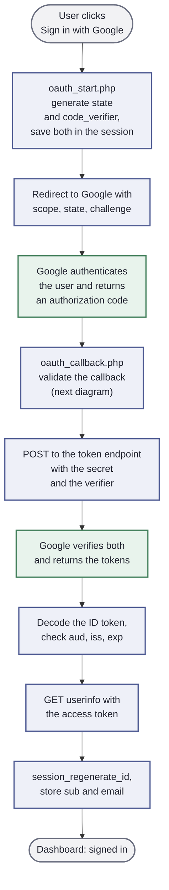
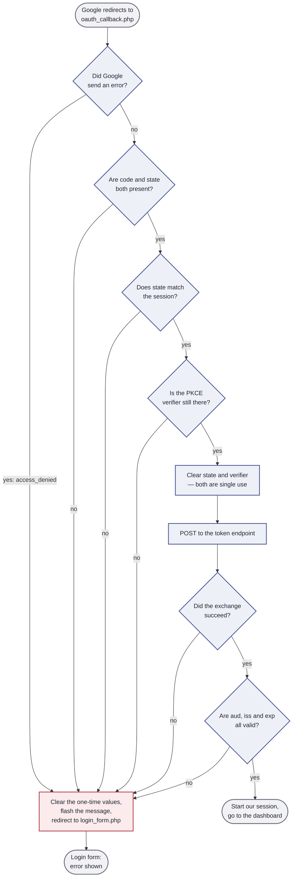
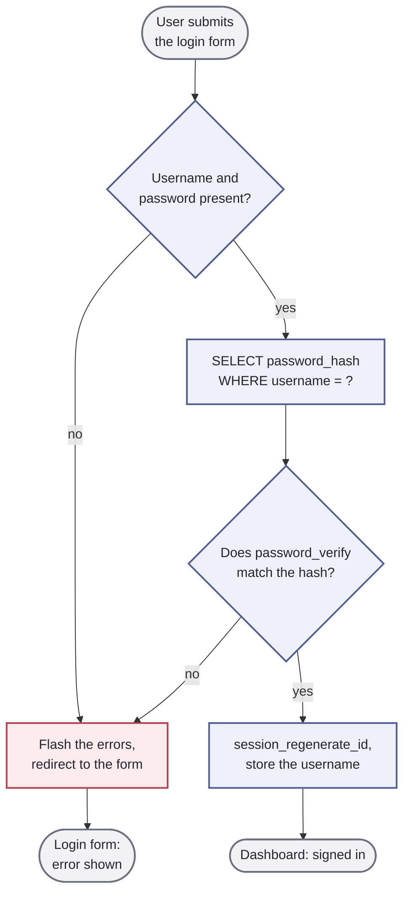

# Activity Diagram: What the Code Decides

Where the sequence diagram shows *who talks to whom*, a UML activity diagram
shows *what gets decided*. Diamonds are decisions, rectangles are actions, and
the rounded boxes at the top and bottom are the start and end of the activity.

Colour tells you who is doing the work: **blue** is our PHP app, **green** is
Google, **grey** is the user, **red** is the failure path.

> **Viewing it:** GitHub renders Mermaid automatically. In VS Code, install the
> *Markdown Preview Mermaid Support* extension and press `Ctrl+Shift+V`. Or paste
> the block into https://mermaid.live.

# The Whole Activity, End To End

Only two activities on that diagram belong to Google. Everything else is ours —
including, as the next diagram shows, all of the checking.

# The Validation Inside oauth_callback.php

The box marked *validate the callback* hides six decisions. Here they are, in the
order the code runs them.

# What To Notice

**Six decisions, one exit.** Every failure funnels into the same activity: clear
the one-time values, flash a message, redirect. That is the `fail()` helper at
the top of `oauth_callback.php`. Writing it once is what keeps the checks below
it short enough to read.

**The order of the checks is deliberate.** The cheap, local checks run first —
did Google send an error, are the parameters present, does `state` match, is the
verifier still in the session. Only once all four pass do we spend a network
request on the token exchange. Never pay for an expensive check before a free one
can rule the request out.

**Look at how little is green.** Google authenticates the user and verifies the
exchange. Everything else — all six decisions — is ours. Handing authentication
to Google does not hand over the validation.

**`clear` happens before `post`, not after.** The verifier and state are removed
from the session the moment they have been checked, so a replayed callback URL
fails at *"Is the PKCE verifier still there?"* the second time round.

# Compare With login_example4

The same diagram for the password version is much shorter, and that is the point:

Fewer boxes — but notice *what* is missing rather than how many. There is no
network call, no second party and no token. What there is instead is a
`password_hash` column in our database that we have to protect. The extra
complexity in the OAuth2 diagrams is the price of not owning that column.

Notice too that the last two activities are identical in both: `session_regenerate_id`,
store who they are, go to the dashboard. That is the part OAuth2 does not change.
