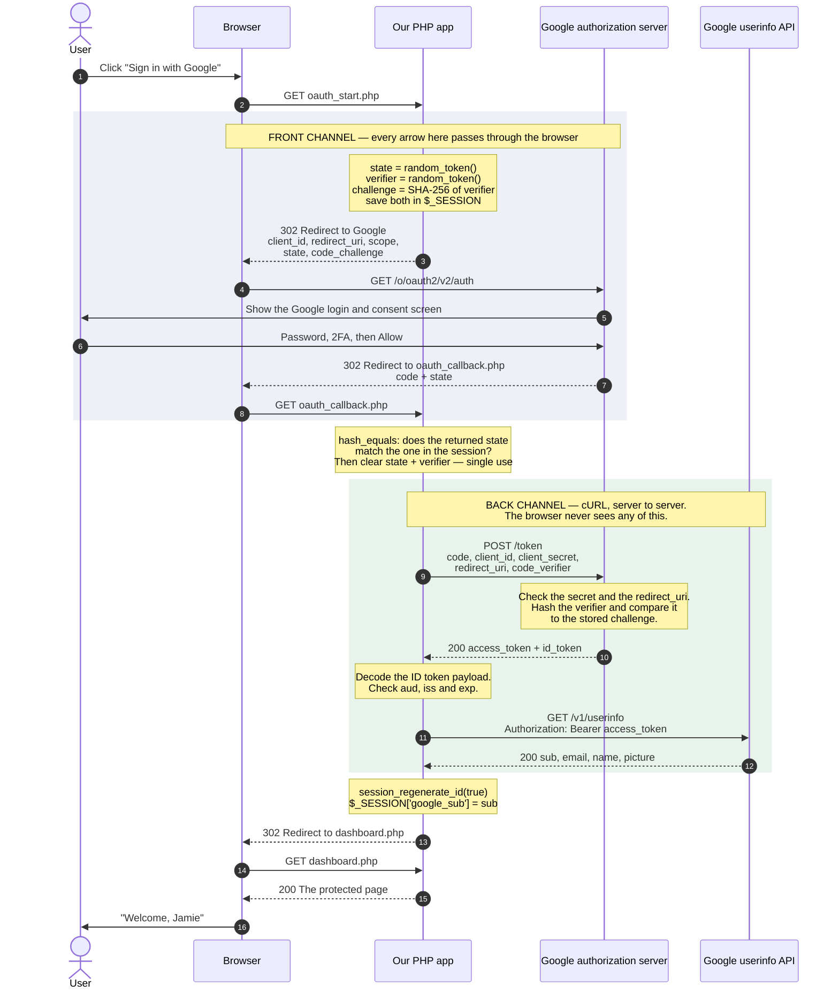
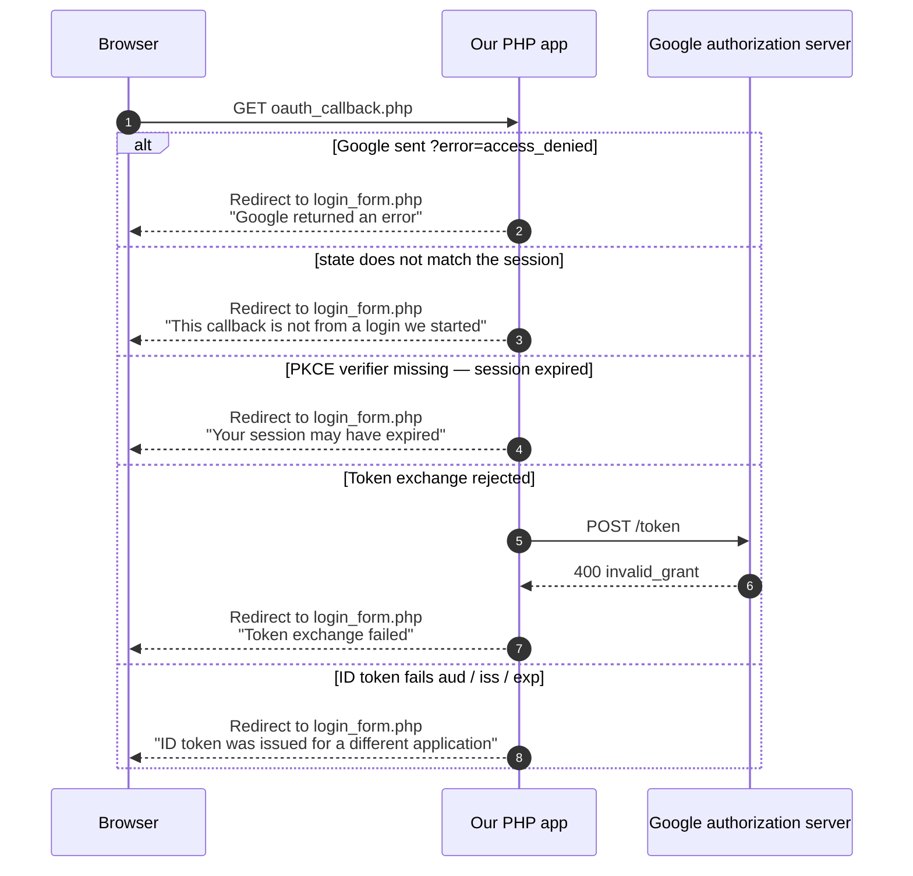

# Sequence Diagram: The Authorization Code Flow

A UML sequence diagram answers one question: **who talks to whom, in what order.**
Each vertical line is a participant, time runs downwards, and the numbered arrows
are the messages between them. Yellow boxes are work a participant does on its
own, without talking to anybody.

Read this alongside `oauth_start.php` and `oauth_callback.php` — every arrow below
is a line of code in one of those two files.

> **Viewing it:** GitHub renders Mermaid automatically. In VS Code, install the
> *Markdown Preview Mermaid Support* extension and press `Ctrl+Shift+V`. Or paste
> the block into https://mermaid.live.

# What To Notice

**The two shaded bands are the whole security story.** In the first band every
arrow goes through the browser, so assume anyone can read it. In the second band
our server talks to Google directly, so that is where the client secret and the
tokens live. The `code` is the only thing that crosses from one band to the
other, and on its own it is worthless.

**Our app talks to Google twice, and they are different conversations.** The POST
to `/token` proves *we* are who we say we are (client secret) and that *we*
started this flow (code verifier). The GET to `/v1/userinfo` then uses the access
token to ask a separate server for data.

**The user's password never appears on this diagram.** It is typed at message 6,
into Google, on Google's own page. Our app has no arrow anywhere near it.

**Count the redirects.** OAuth2 does not use a special protocol. It is ordinary
HTTP redirects and one ordinary POST — you already know every mechanism here.

# The Failure Paths

The diagram above shows the happy path. `oauth_callback.php` can bail out at five
points, and every one ends the same way: clear the one-time session values, flash
an error, redirect back to `login_form.php`.

Every branch redirects rather than rendering a page, so a refresh never replays
the attempt — the same POST/Redirect/GET habit as `login_example4`. Notice that
only one branch costs a network request: the four cheap checks all run first.
